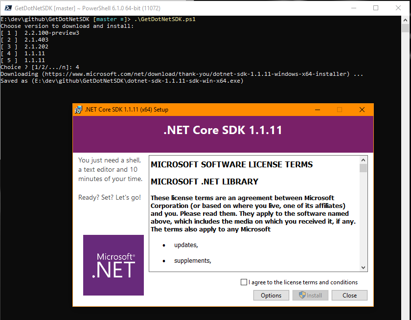

# GetDotNetSDKConsole
Download and install specific Dot Net SDK from command line.

# How to use
Build and run from accessible path.  
A list of SDKs available will be displayed and you make a choice.  
That SDK will download and once completed will launch automatically.  

# Tricky Part
This isn't straight forward with downloading from a direct link.  When you select the download link the page redirects to a download page so using DownloadFile doesn't work.  So a further check on the redirected page for the retry link is located and used to download the file directly.  
  
  
